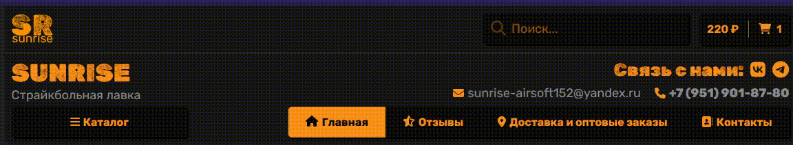
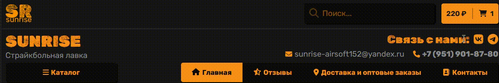
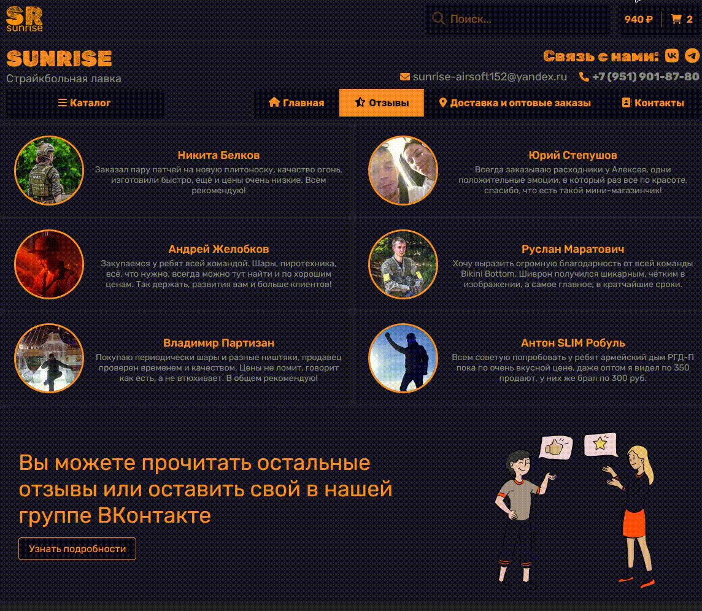
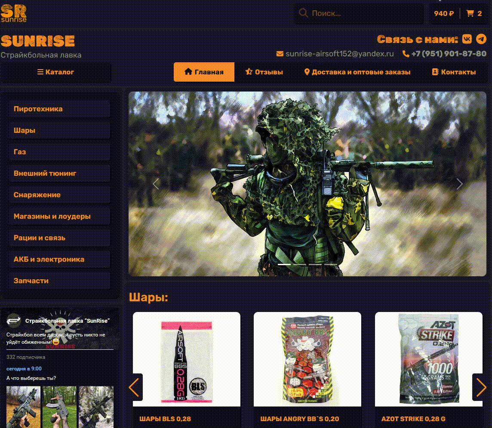
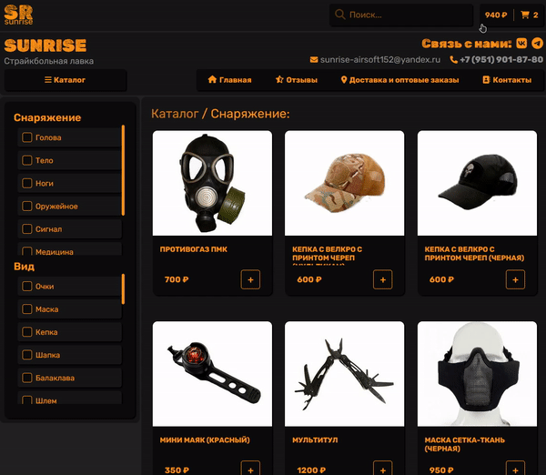
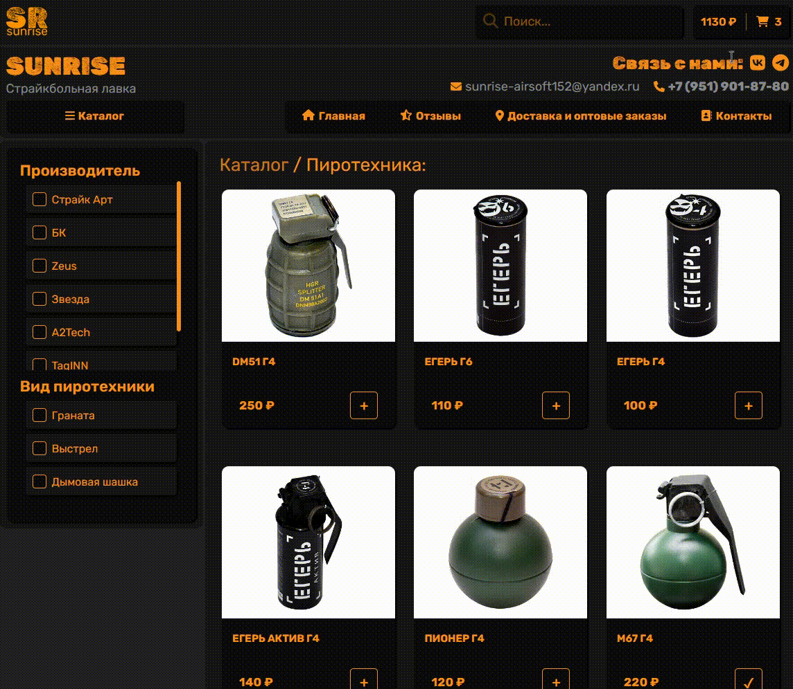
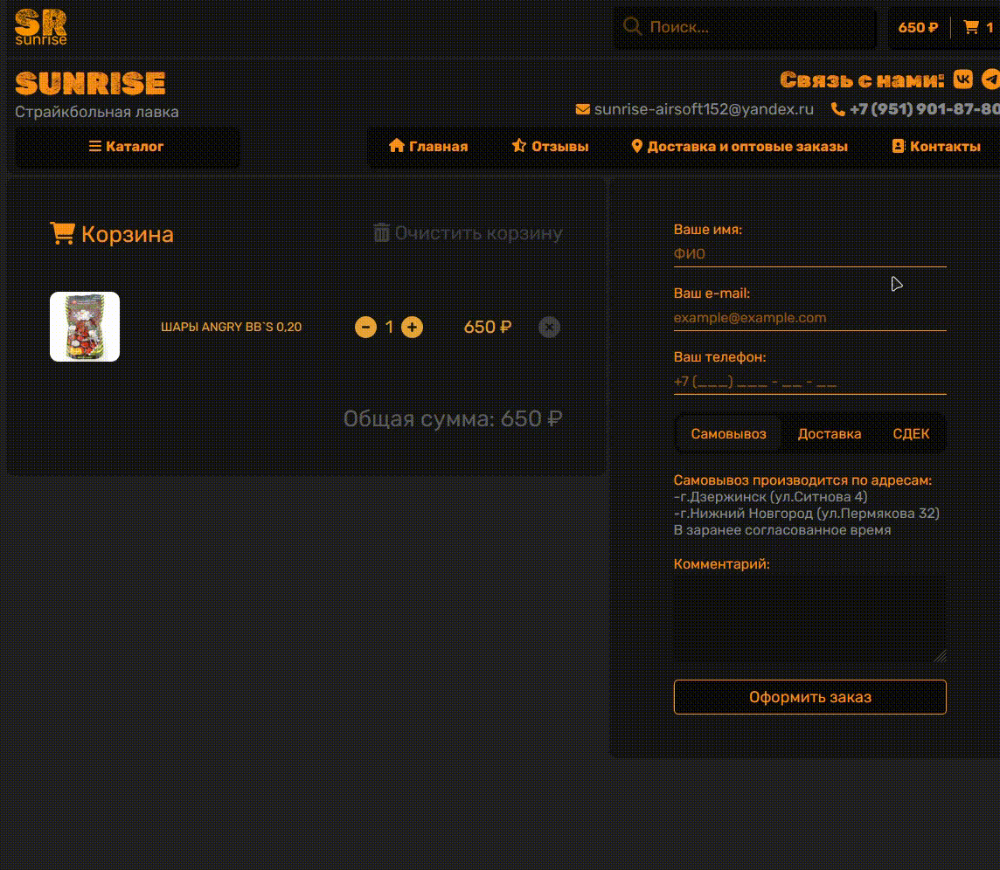
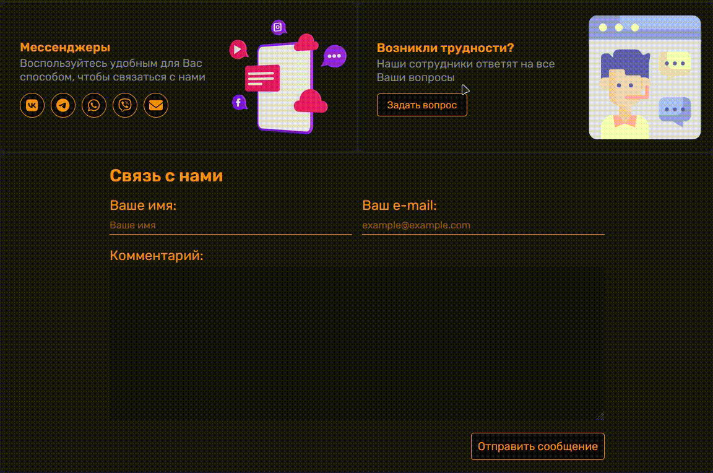
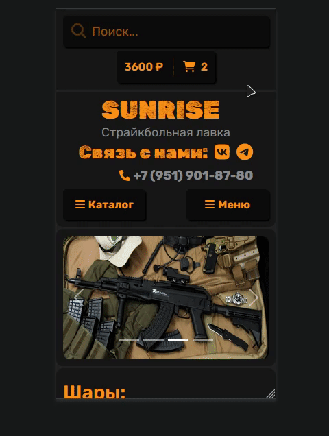

<h1>Интернет - магазин SunRise</h1>

<h3><b>Технологии</b></h3>
Написан, на React с использованием TypeScript. 
В качестве БД - товары ВК -> МойСклад. 
Для запросов на БД и отправки почты (email и telegram), написан сервер на Node js. Технологии: API VK, API TG, Nodemailer. 
Для управления состоянием данных использовался Redux Toolkit. 
Для роутинга React Router.

<h2><b>Сайт</b></h2>
<i>Обновляемая информация</i>

<h3><b>Header</b></h3>

<h3><b>Sticky Header</b></h3>

<h3><b>Search</b></h3>

<h3><b>Остальные страницы</b></h3>

<h3><b>Каталог</b></h3>

<h3><b>Пагинация на конец страницы</b></h3>

<h3><b>Сортировка</b></h3>

<h3><b>Страница товара</b></h3>

<h3><b>Корзина</b></h3>

<h3><b>Оформеление заказа</b></h3>

<h3><b>Контакты</b></h3>

<h3><b>Результаты оформления заказа и отправки сообщения приходят на почту и Телеграм</b></h3>

<h3><b>Адаптивность</b></h3>

